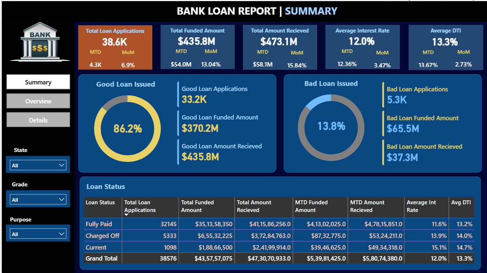
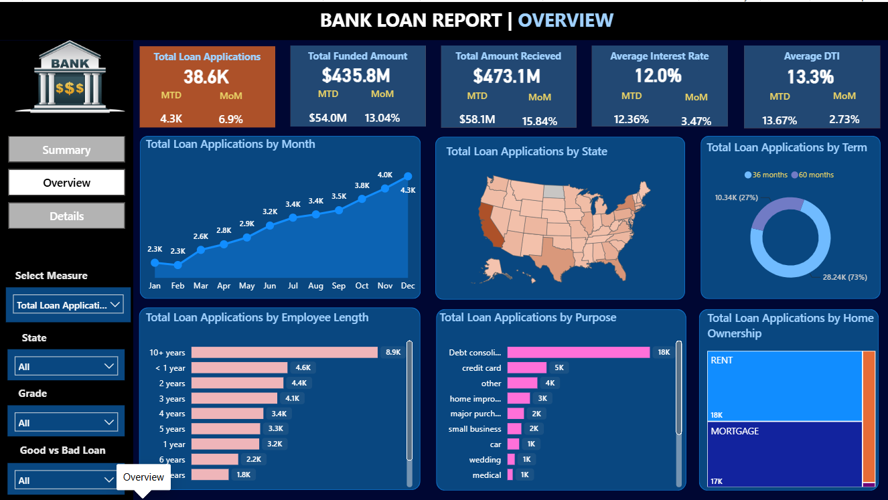
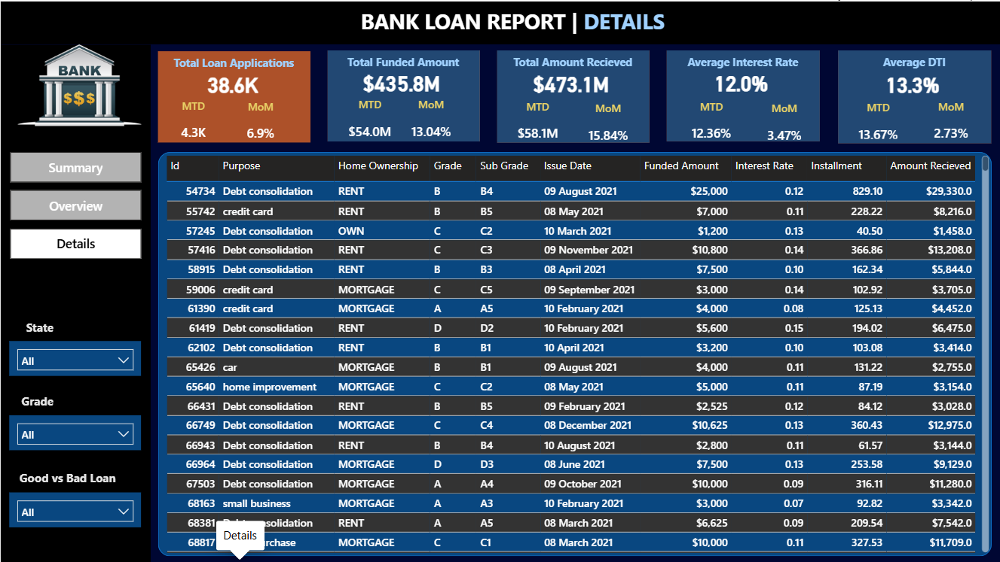

# 🏦 Bank Loan Analysis Dashboard
## 📌 Project Overview
The **Bank Loan Analysis Dashboard** is an interactive data analytics project developed using **Microsoft Power BI** to analyze loan applications, funded amounts, repayments, loan performance, and borrower risk.

The dashboard provides meaningful insights into **loan trends, loan status, customer profiles, loan purposes, and risk indicators** through interactive visualizations.
## 🎯 Project Objectives
- 📊 Analyze total loan applications and funded amounts
- 💰 Monitor total amount received and repayment performance
- ✅ Compare Good Loans and Bad Loans
- 📅 Track monthly and Month-to-Date (MTD) performance
- 📈 Analyze loan trends over time
- 👥 Understand borrower characteristics
- 🏷️ Analyze loan purpose, grade, and sub-grade
- 🏠 Analyze home ownership and employment length
- ⚠️ Monitor interest rates and Debt-to-Income (DTI) ratios
## 🛠️ Tools & Technologies

- 📊 **Microsoft Power BI** – Dashboard development and data visualization
- 🔄 **Power Query** – Data cleaning and transformation
- 🧮 **DAX** – KPI calculations and analytical measures
- 🗄️ **SQL** – Data analysis and querying
## 📑 Dashboard Pages
### 1️⃣ Summary Dashboard
Provides a high-level overview of overall loan performance.

### 2️⃣ Overview Dashboard
Provides detailed analysis of loan applications and borrower trends.

### 3️⃣ Details Dashboard
Provides detailed loan-level information.

